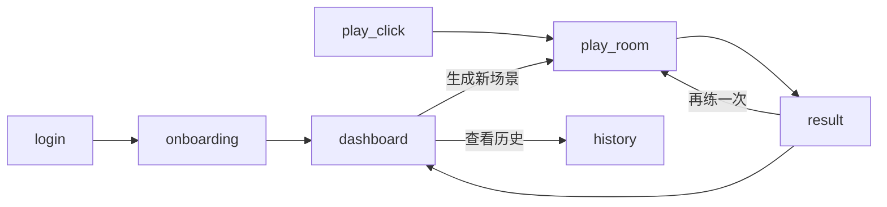

# EQteacher — 基于 Web 的情商对话训练器（MVP‑1）

## 0. 文档目的

这是一个由单人开发、面向全球（首发美国）的 SaaS 产品，通过短场景化对话帮助用户在 **职场、社交、家庭、亲密关系、旅行** 等多种日常情境中提升情商与沟通软技能，并获得可执行反馈。本文档定义首个公开版本（MVP‑1）的范围，整体技术栈为 **Next.js 14（App Router）+ Tailwind CSS + Vercel**，大模型服务统一通过 **OpenRouter LLM API** 调用。

---

## 1. 问题与愿景

* **问题：** 现代人常在不同情境（如职场 1‑on‑1、第一次约会、家庭冲突、陌生人寒暄、旅途中投诉）中因沟通技巧不足而产生尴尬、冲突或错失机会；现有工具零散且多聚焦单一场景，缺乏统一、互动且成本友好的训练方案。
* **愿景：** 提供游戏化的 **3 轮 AI 角色扮演**，用户可根据情境自由生成剧本；系统在 **10 秒内** 输出定量（分数）+ 定性（改进建议）反馈，并通过渐进难度与可分享视觉总结驱动留存、裂变。

---

## 2. 目标市场与用户画像

| Persona                 | 主要痛点          | 成功指标                   |
| ----------------------- | ------------- | ---------------------- |
| **Sarah**（26 岁，初级后端工程师） | 不敢给经理提出建设性反馈  | 在“经理 1:1”场景得分 ≥80      |
| **Michael**（33 岁，销售代表）  | 需要更好地处理客户异议   | 在“客户异议处理”三级难度中得分 >90   |
| **Emily**（22 岁，大学生）     | 想在初次约会中表现自然自信 | 在“第一次约会寒暄”场景得分 ≥85     |
| **David**（40 岁，新手爸爸）    | 与青春期孩子沟通困难    | 在“家庭冲突调解”场景得分 ≥80      |
| **L\&D 经理**（B2B）        | 需要规模化培训团队软技能  | 团队 70 % 成员每月完成 ≥10 场训练 |

首发策略为 **B2C Freemium**，重点推广职场与社交场景以验证付费意愿；后续根据数据逐步开放家庭、旅行等域，并推出团队版功能。

\---------|---------|---------| | **Sarah**（26 岁，初级后端工程师） | 不敢给经理提出建设性反馈 | 在“经理 1:1”场景得分 ≥80 | | **Michael**（33 岁，销售代表） | 需要更好地处理客户异议 | 在“客户异议处理”三级难度中得分 >90 | | **L\&D 经理**（B2B） | 希望以规模化方式培训软技能 | 团队 70 % 成员每月完成 ≥10 场训练 |

首发策略为 **B2C Freemium**；企业后台与团队版功能留待后续版本。

---

## 3. 核心用例与用户故事

1. **US01 – 快速练习**
   *作为普通用户*，我选择一个场景，对话 1 回合即可获得反馈。
2. **US02 – 进度追踪**
   *作为订阅用户*，我希望在仪表盘查看最近 30 场训练的分数与建议。
3. **US03 – 视觉分享**
   *作为用户*，我可以导出一张四格漫画，总结本次对话并分享至社媒。
4. **US04 – 付费墙**
   *作为免费用户*，每月完成 3 场训练后系统提示升级 Pro。

---

## 4. 功能需求（MVP‑1）

### 4.1 动态场景生成（完善）

* **多域支持**：场景按 `domain` 划分，目前预置 6 类：

  1. `workplace` —— 职场沟通（默认在 UI 暴露）
  2. `social` —— 社交寒暄 & 破冰
  3. `networking` —— 商务酒会 / 线下活动
  4. `dating` —— 约会或伴侣沟通
  5. `family` —— 亲子 / 家庭冲突
  6. `travel` —— 旅途与酒店服务 *MVP 仅主推 workplace，其余域以「随机彩蛋」方式上线；当某域累计 ≥ 50 场有效评分且平均有用度 ≥ 4 / 5 时，即在页面显式解锁。*

* **接口**：`POST /api/generate-scenario`

  * **入参**

    | 字段           | 类型     | 说明                                | 默认          |
    | ------------ | ------ | --------------------------------- | ----------- |
    | `skill`      | string | 目标技能关键词，如 "feedback"、"small talk" | 可为空         |
    | `difficulty` | 1‑3    | 1 = 简单，3 = 挑战                     | 1           |
    | `domain`     | enum   | 见上表                               | `workplace` |
  * **出参**（新增 `domain`, `difficulty` 字段）：

    ```jsonc
    {
      "id": "dyn_20250605_abcdef",
      "title": "Deliver Constructive Feedback to Your Manager",
      "domain": "workplace",
      "difficulty": 2,
      "system_prompt": "...",
      "rubric": [
        {"name": "Empathy", "weight": 0.4},
        {"name": "Clarity", "weight": 0.3},
        {"name": "Assertiveness", "weight": 0.3}
      ]
    }
    ```

* **安全 & 质量控制流程**

  1. 调用 `OpenAI Moderation` 对入参 `skill`/`domain` 和出参 `system_prompt` 进行审查。
  2. 校验 Rubric：维度数 2‑4，权重相加 = 1；不符则自动重试 ≤ 3 次，否则回退到官方模板。

* **持久化 & 推荐**

  * 写入表 `scenarios_dynamic`（新增 `domain`, `difficulty` 字段）。
  * 周期性任务汇总各域 `play_count / usefulness_avg` 决定是否解锁 UI 入口。

* **刷新机制**

  * 对话开始前或首轮对话后 ≤ 5 秒内，用户可点击 “换一个场景” 重新生成；计 `skip_count`。超过 5 秒或进入第 2 轮时禁用刷新，保证训练完整性。

### 4.2 对话引擎（完善）

#### 4.2.1 状态机

```text
┌───────────────┐      user /start      ┌────────────┐
│   idle        │ ─────────────────────▶│ generating │
└───────────────┘                       └────────────┘
         ▲                                  │  success /failover
         │                                  ▼
         │                            ┌────────────┐  ai send open
         │        session /reset      │  active    │◀──────────────
         └────────────────────────────┤ turn = n   │  user message
                                      │ (0‑3)      │
                                      └─────┬──────┘  if n == 3 | /end
                                            ▼
                                      ┌────────────┐  eval agent
                                      │  grading   │
                                      └─────┬──────┘
                                            ▼
                                      ┌────────────┐  result to client
                                      │ completed  │
                                      └────────────┘
```

#### 4.2.2 会话控制逻辑（伪代码）

```ts
// /api/chat  (Edge Function)
const MAX_TURNS = 3; // user turns

export async function POST(req: Request) {
  const { sessionId, message } = await req.json();
  const session = await getSession(sessionId);

  // 1. 是否已完成
  if (session.status === 'completed') return NextResponse.json({ error: 'Session ended' }, { status: 409 });

  // 2. 是否超出轮次
  if (session.turn >= MAX_TURNS) {
    return NextResponse.json({ error: 'Turn limit reached' }, { status: 409 });
  }

  // 3. 追加用户消息到 messages 并调用 OpenRouter
  session.messages.push({ role: 'user', content: message });
  const aiStream = streamFromOpenRouter(session.messages);

  // 4. 流式返回 AI 回复并在尾部 onComplete 回调里 ++turn
  return streamResponse(aiStream, {
    onComplete: async (assistantReply) => {
      session.messages.push({ role: 'assistant', content: assistantReply });
      session.turn += 1;
      await saveSession(session);

      // 5. 若 turn == MAX_TURNS || message.startsWith('/end')
      if (session.turn >= MAX_TURNS || message.startsWith('/end')) {
        queueEvaluation(session.id); // 调用 /api/eval 异步评分
      }
    }
  });
}
```

* **提前结束**：用户发送 `/end`、`/quit` 或 UI 中点击 “立即评分” 按钮即触发评分，哪怕不足 3 轮。
* **超时自动结束**：若用户在任意阶段 60 秒无输入，前端弹窗提醒并提供 “结束并评分” 或 “继续” 选项；后台 5 分钟后自动调用评分。
* **评分路径**：`/api/eval` 接口接收 `sessionId`，读取全部对话、`rubric`、`domain`，调用评分 Agent → 存储 → 返回给前端。
* **并发处理**：session 表的 `turn` 字段使用 Postgres `SELECT … FOR UPDATE` 锁定，避免并行请求串行化错误。

\---- 对话引擎（更新）

| 步骤 | 角色       | 描述                                                                              |
| -- | -------- | ------------------------------------------------------------------------------- |
| -1 | System   | 若用户选择“AI 生成”或未传固定 id，则调用 `/api/generate-scenario`，若失败则回退到官方模板                   |
| 0  | System   | 根据返回/缓存的 `system_prompt` 初始化对话                                                  |
| 1  | AI       | 发送开场白（≈40 tokens）                                                               |
| 2  | User     | 用户输入（文字或语音 → Whisper）                                                           |
| 3  | AI       | AI 回复                                                                           |
| 4  | User     | 用户最后一次回复（可选，**最多 3 轮**）                                                         |
| 5  | 评分 Agent | 调用 `anthropic/claude-3-sonnet`，依据动态 `rubric` 生成评分 JSON                          |
| 6  | Storage  | 将对话 & 评分写入 `session_results`；更新 `scenarios_dynamic.play_count / usefulness_avg` |

### 4.3 反馈与分享 反馈与分享

* 组件 `<SessionResult>` 显示圆环分数 + 建议列表。
* “生成漫画”按钮：POST `/api/comic` → SDXL（暂以占位图替代）。

### 4.4 账户与计费

* 认证：NextAuth.js（邮箱或 Google 登录）。
* Stripe Checkout + Customer Portal：

  | 方案   | 价格            | 配额        |
  | ---- | ------------- | --------- |
  | Free | \$0           | 每月 3 场对话  |
  | Pro  | \$7/月         | 对话不限，解锁漫画 |
  | Team | \$499/年/≤20 人 | 团队仪表盘     |
* 配额字段 `session_credits` 存储于 Supabase Postgres。

### 4.5 数据分析

* PostHog（≤5k 事件免费）：PV、完成率。
* 自定义事件 `score_total` 用于 cohort 分析。

---

## 5. 非功能要求

| 类别   | 目标                                |
| ---- | --------------------------------- |
| 响应延迟 | 单次完整评分 < 10 s                     |
| 可用性  | 99.5 %（Vercel Edge 多区域）           |
| 无障碍  | 达到 WCAG AA                        |
| 安全   | 符合 SOC‑2；全站 HTTPS；密钥存于 Vercel Env |

---

## 6. 技术栈与架构

### 6.1 前端

* **Next.js 14 App Router**
* **Tailwind CSS v3**
* Headless UI + Radix 组件保证可访问性
* Zustand 做轻状态管理

### 6.2 后端

| 层级     | 技术                                     |
| ------ | -------------------------------------- |
| API 路由 | `/api/chat`, `/api/eval`, `/api/comic` |
| 运行时    | Vercel Edge Functions（Deno）            |
| 数据库    | Supabase Postgres                      |
| 存储     | Supabase Bucket（漫画）                    |

### 6.3 数据流

1. 前端 POST `/api/chat`
2. Edge 向 **OpenRouter** 请求流式对话
3. `fetchEventSource` 将回复流推送至客户端
4. 3 轮后，前端 POST `/api/eval`，附全对话
5. 评分 Agent 返回 JSON，写入 `session_results` 表

### 6.4 OpenRouter 调用示例

```http
POST https://openrouter.ai/api/v1/chat/completions
Authorization: Bearer $OPENROUTER_KEY
{
  "model": "openai/gpt-4o-mini", // 约 $0.0005 / 1k tokens
  "max_tokens": 256,
  "messages": [...]
}
```

* **模型选择**

  | 场景       | 模型                                   | 理由           |
  | -------- | ------------------------------------ | ------------ |
  | 对话 Agent | `openai/gpt-4o-mini`                 | 质价比高         |
  | 评分 Agent | `anthropic/claude-3-sonnet-20240229` | Rubric 打分更稳定 |
* Whisper 与 SDXL 同样走 OpenRouter 代理（未来）。

### 6.5 环境变量（Vercel）

| Key                                 | 示例                        |
| ----------------------------------- | ------------------------- |
| OPENROUTER\_API\_KEY                | `sk-or-************`      |
| STRIPE\_SECRET\_KEY                 | `sk_live_********`        |
| SUPABASE\_URL & SUPABASE\_ANON\_KEY | `https://xyz.supabase.co` |

---

## 7. UX / UI 需求

### 7.1 页面结构（首版）

1. `/` —— Landing（Hero、Features、Pricing、FAQ、Footer）
2. `/app/onboarding` —— 初次登录引导（选择目标域 + 教学动画，1‑2 步完毕）
3. `/app` —— 仪表盘（场景列表、最近成绩、进度徽章）
4. `/app/play/[id]` —— 对话房间（实时流式对话）
5. `/app/result/[sessionId]` —— 评分与复盘（分数环 + 维度明细 + 漫画预览）
6. `/pricing` —— 价格详情 + Checkout
7. `/privacy` & `/tos` —— 法务页

### 7.2 组件规范

* **Header**：置顶，Logo + 链接（Features、Pricing、FAQ）+ Login CTA
* **Hero**：左右双列；左为文案，右为自动播放演示视频
* **Feature Cards**：三栏网格，图标用 Lucide
* **CTA Banner**：渐变背景，大号“立即免费体验”按钮
* **Footer**：列式布局，站点地图、社媒、版权

### 7.3 交互流程与状态机

#### A) Onboarding（首次使用）

| 步骤 | 画面要素            | 交互         | 备注                             |
| -- | --------------- | ---------- | ------------------------------ |
| 1  | Welcome 卡片      | `Next` 按钮  | 背景半透明渐变                        |
| 2  | 选择目标域（多选 Chips） | 点击 Chip 高亮 | 至少选 1；存于 `user.preferences`    |
| 3  | Quick‑Tip 导览    | 3 张插图滑屏    | 第三屏底部 **Start First Practice** |
| 4  | 跳转 `/app`       | —          | 若此前未绑定邮箱则提示完成个人信息              |

#### B) Scenario Selection（仪表盘）

* **顶部筛选**：Domain 下拉 + 难度切换（Tabs `Easy` `Medium` `Hard`）。
* **卡片**：左侧场景标题 + 子描述；右侧按钮 **Play**。
* **生成新场景**：浮动按钮 `+`，点击后弹出对话框输入关键字，提交即调用 `/api/generate-scenario` 并在列表首位插入新卡片（带 `✨新` 标签）。

#### C) Conversation Room（/app/play/\[id]）

| 元素               | 交互                 | 动效             |
| ---------------- | ------------------ | -------------- |
| 系统开场气泡           | 自动出现               | Fade‑in 200 ms |
| 用户输入框            | 支持文字 / 语音（Mic 按住录） | 语音转文字时显示波形动画   |
| Typing Indicator | AI 生成时三个跳动点        | 点大小循环 1.2 s    |
| 向上滑动             | 查看完整历史             | Sticky scroll  |
| 结束按钮             | `/end`             | 二次确认 Modal     |

#### D) Evaluation & Review（/app/result/\[sessionId]）

* **评分环**：Animate from 0 → 100 within 1 s。
* **维度条**：条形 Progress；Hover 显示维度解释。
* **改进建议**：列表折叠；点击项可复制模板句子。
* **漫画预览**：Skeleton → 成功后淡入；按钮 **Download PNG**。
* **再练一次**：按钮跳转 `/app/play?difficulty=+1`。

#### E) History & Gamification（仪表盘侧栏）

* 最近 7 天成绩折线图（mini‑sparkline）。
* 徽章区：“首次满分”“跨域达人”“连续 7 天练习”等；Hover 彈出获奖条件。

#### 关键状态流



### 7.4 可访问性 & 动效

* 键盘可达顺序：Header → Main → Footer；对话框 `focus‑trap`。
* 所有按钮设 `aria‑label`。
* 动画持续 ≤ 400 ms，均可在系统“减少动效”设置时禁用。

\---. 对话 UI 规范

| 元素          | 说明                                 |
| ----------- | ---------------------------------- |
| Chat Bubble | 宽度 90%，圆角 2xl，浅色/主色两种              |
| Input Box   | 自动聚焦 textarea，最多 3 行，Ctrl+Enter 发送 |
| Timer       | 小徽章展示自最后 AI 回复起的秒数（<5 s 为佳）        |
| Score Modal | 居中弹窗，圆环进度 + 建议列表                   |

---

## 9. 核心指标（KPI）

* **激活率**：完成 1 场训练 / 注册 用户 > 40 %
* **平均分提升**：前 10 场与后 10 场平均分差 > 15 分
* **Pro 转化**：免费转付费 14 日内 > 2 %
* **月活流失**：MAU Churn < 8 %

---

## 10. 安全与隐私

* 遵循 GDPR / CCPA 通知
* 原始对话保存 30 天，评分数据永久留存（用于分析）
* 支持用户关闭“数据用于模型训练”选项

---

## 11. MVP 之后路线（参考）

1. **视频 Avatar**（D‑ID）
2. **团队管理后台**
3. **多语言本地化**（西班牙语、简体中文）
4. **原生移动壳**（Expo）

---

## 12. 待解决问题

* 哪款漫画生成服务（InvokeAI、Replicate 等）免费额度最佳？
* 语音输入需麦克风权限，是否在 v1 就启用？

---

*文档版本：2025‑06‑05 — 维护人 @yi1358395292*
